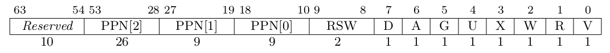
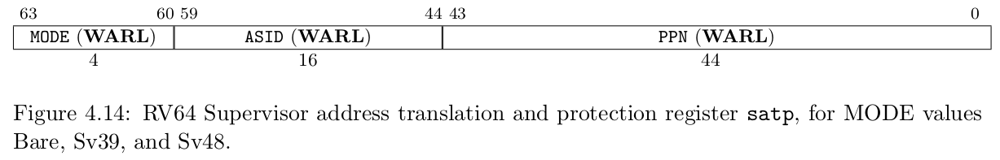
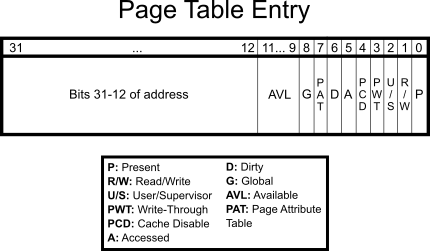

# Trap，syscall 与上下文管理

参考: [axcpu](https://arceos.org/arceos-crates-book/axcpu)

- riscv:
    - Trap 处理流程:
        1. 内核设置 Trap 向量地址到 `stvec` 寄存器。
        2. 用户态程序执行 `ecall` 指令触发 Trap / 执行出现错误触发异常。
        3. CPU设置 `sepc` 为触发 Trap 的指令地址，`sstatus.SPP` 为CPU当前的特权级(U/S)，`scause` 为 Trap 原因，`stval` 为相关的附加信息。
        4. 跳转到 `stvec` 指定的 Trap 处理函数地址，切换到内核态。
        5. 保存Trap上下文到内核栈，然后跳转到Trap处理函数。
        6. 在 Trap 处理函数中，根据 `scause` 寄存器的值判断是 syscall 还是其他异常，进行处理。 
        7. Trap处理完成后，恢复用户态上下文，通过`sret`指令返回用户态继续执行。
    - Trap上下文：
        - 通用寄存器 x0-x31
            - ra: 返回地址
            - sp: 堆栈指针
            - gp: 全局指针
            - tp: 线程指针
            - t0-t6: 临时寄存器
            - s0-s11: 被调用者保存寄存器
            - a0-a7: 函数参数/返回值寄存器
        - `sstatus` 状态寄存器
        - `sepc` 异常程序计数器
        ```Rust
        #[repr(C)]
        pub struct TrapContext {
            /// general regs[0..31]
            pub x: [usize; 32],
            /// CSR sstatus
            pub sstatus: Sstatus,
            /// CSR sepc
            pub sepc: usize,
            /// Addr of trap handler
            pub kernel_satp: usize,
            /// Kernel stack pointer of the app
            pub kernel_sp: usize,
            /// Addr of trap handler
            pub trap_handler: usize,
        }
        ```
    - 任务上下文：
        - ra
        - sp
        - s0-s11
        ```Rust
        #[derive(Debug, Clone, Copy, Default)]
        #[repr(C)]
        pub struct TaskContext {
            /// ra
            ra: usize,
            /// sp
            sp: usize,
            /// s0 ~ s11
            s: [usize; 12],
        }
        ```
    - syscall：
        - 通过 `a7` 寄存器传递 syscall 编号，`a0-a6` 传递参数。
        - syscall 处理函数根据 `a7` 的值调用对应的内核服务函数，结果通过 `a0` 返回给用户态程序。
        - syscall 返回时，更新 `sepc` 指向下一条指令，确保用户态程序继续执行。
- x86-64:
    - Trap 处理流程:
        1. 内核设置 IDT（中断描述符表）来处理各种中断和异常。
        2. 用户态程序执行 `int 0x80` 指令触发 Trap / 执行出现错误触发异常。
        3. CPU切换到内核栈，依次压入堆栈段寄存器`SS`，堆栈指针`RSP`，标志寄存器`RFLAGS`，代码段寄存器`CS`，指令指针`RIP`，错误码（如果有的话）到内核栈。
        4. 跳转到 IDT 中对应的 Trap 处理函数地址，清空`RFLAGS`, 切换到内核态。
        5. 保存Trap上下文到内核栈，然后跳转到Trap处理函数。
        6. 在 Trap 处理函数中，根据中断号判断是 syscall 还是其他异常，进行处理。 
        7. Trap处理完成后，恢复用户态上下文，通过 `iretq` 指令返回用户态继续执行。
    - Trap上下文：
        - 通用寄存器 RAX, RBX, RCX, RDX, RSI, RDI, RBP, RSP, R8-R15
        - CPU自动保存 SS, RSP, RFLAGS, CS, RIP, 错误码（如果有的话）
        ```Rust
        #[repr(C)]
        #[derive(Debug, Default, Clone, Copy)]
        pub struct TrapFrame {
            pub rax: u64,
            pub rcx: u64,
            pub rdx: u64,
            pub rbx: u64,
            pub rbp: u64,
            pub rsi: u64,
            pub rdi: u64,
            pub r8: u64,
            pub r9: u64,
            pub r10: u64,
            pub r11: u64,
            pub r12: u64,
            pub r13: u64,
            pub r14: u64,
            pub r15: u64,

            // Pushed by `trap.S`
            pub vector: u64,
            pub error_code: u64,

            // Pushed by CPU
            pub rip: u64,
            pub cs: u64,
            pub rflags: u64,
            pub rsp: u64,
            pub ss: u64,
        }
        ```
        (这里的 `vector` 是中断向量号)
    - 任务上下文：
        - 被调用者保存寄存器: RBX, RBP, R12-R15
        - rsp
        - 切换时用到TSS的 rsp0
        ```Rust
        #[derive(Debug)]
        pub struct TaskContext {
            /// The kernel stack top of the task.
            pub kstack_top: VirtAddr,
            /// `RSP` after all callee-saved registers are pushed.
            pub rsp: u64,
            /// Thread Local Storage (TLS).
            pub fs_base: usize,
            /// The `gs_base` register value.
            #[cfg(feature = "uspace")]
            pub gs_base: usize,
            /// Extended states, i.e., FP/SIMD states.
            #[cfg(feature = "fp-simd")]
            pub ext_state: ExtendedState,
            /// The `CR3` register value, i.e., the page table root.
            #[cfg(feature = "uspace")]
            pub cr3: memory_addr::PhysAddr,
        }
        ```
    - syscall：
        - 通过 RAX 传递 syscall id，RDI, RSI, RDX, R10, R8, R9 传递参数，CS & 0b11确定是否来自用户态。
        - syscall结果通过 RAX 返回给用户态程序。
        - syscall返回时，更新RIP指向下一条指令，确保用户态程序继续执行。

# 内存管理

参考: [page_table_multiarch](https://arceos.org/arceos-crates-book/page_table_multiarch)

- riscv:
    - Sv39 页表结构:
        - 三级页表，39位虚拟地址
        - 每级页表包含 512 个页表项（PTE），每个 PTE 大小为 8 字节
        - 虚拟地址分为: VPN[2](38-30), VPN[1](29-21), VPN[0](20-12)，页内偏移(11-0)
    - 页表项格式:
        - 物理页框号(PPN), 标志位V(有效), R(可读), W(可写), X(可执行), U(用户), G(全局), A(访问), D(脏)。
        
    - 页表设置
        - 使用 `satp` 寄存器设置页表根地址和模式。
        
- x86-64:
    - 四级页表结构:
        - 四级页表: 48位虚拟地址，PML4, PDPT, PD, PT
        - 每级页表包含 512 个页表项，每个 PTE 大小为 8 字节
        - 虚拟地址分为四部分: PML4(47-39), PDPT(38-30), PD(29-21), PT(20-12), 页内偏移(11-0)
    - 页表项格式:
        - 物理页框号(PPN)，标志位: P (存在), R/W (可读/写), U/S (用户/超级用户), PWT (页写通道), PCD (页缓存禁用), A (访问), D (脏), PAT (页属性表), G (全局) 
        
    - 页表设置
        - 使用 `CR3` 寄存器设置页表根地址。
        - 使用 `CR0` 和 `CR4` 寄存器启用分页和相关功能。


